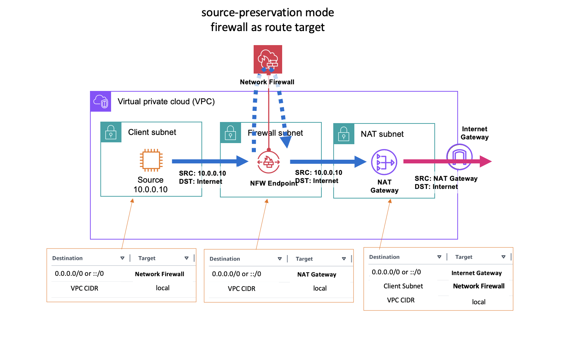
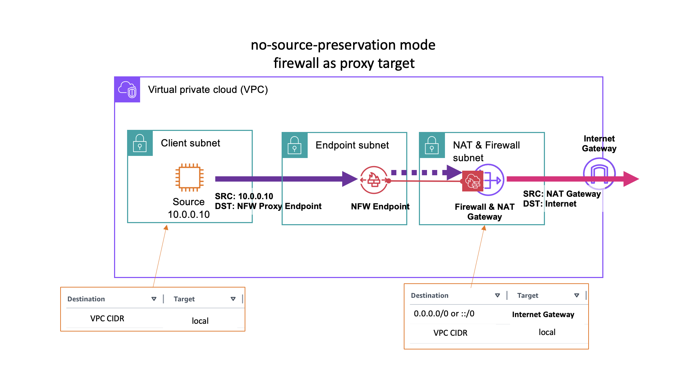
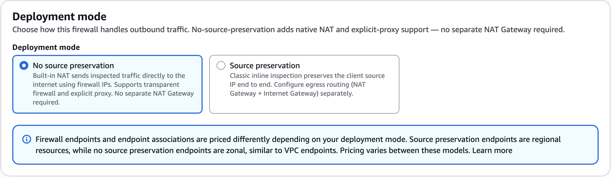
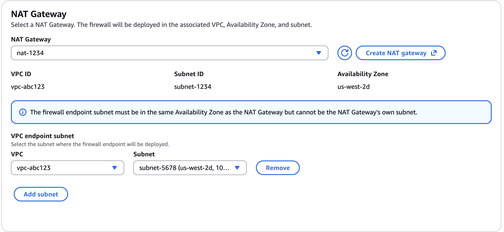
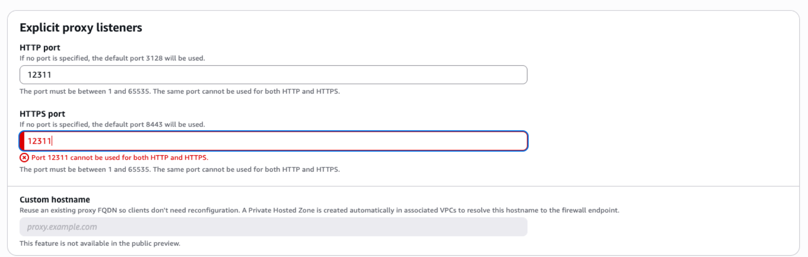
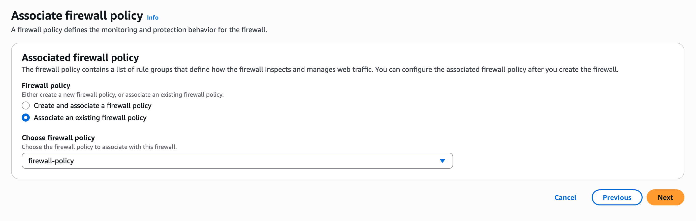
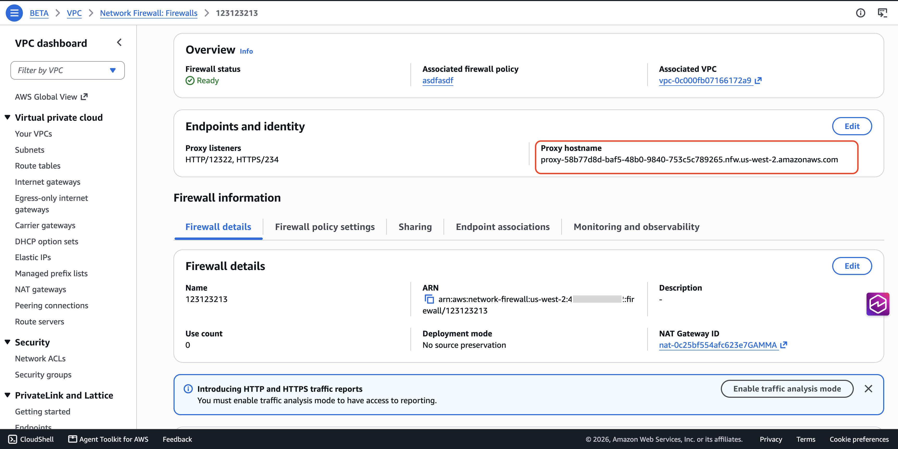
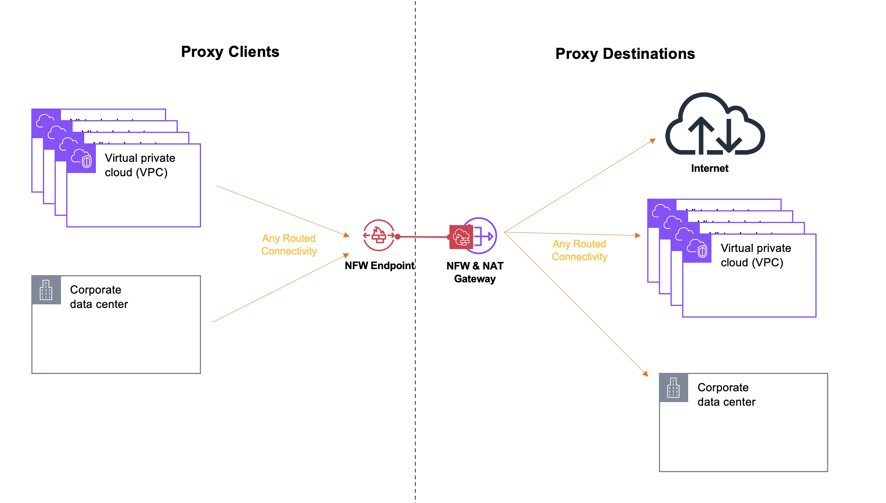

# 重新推出 Network Firewall 代理，实现安全出站连接

作者：Tom Adamski、Akshay Choudhry | 2026年8月4日

原文链接：https://aws.amazon.com/blogs/networking-and-content-delivery/reintroducing-network-firewall-proxy-for-secure-egress-connectivity/

---

在 re:Invent 2025 上，我们以预览版形式发布了 AWS Network Firewall proxy，以便在正式发布前收集客户反馈。反馈清晰而一致：客户希望能灵活地将 Network Firewall 连同其所有现有能力一起用作显式代理（explicit proxy）。客户表示，与其管理一个拥有独立安全策略模型的单独代理产品，他们更希望在透明防火墙和显式代理两种场景中应用同一套安全策略，并在使用代理时获得 Network Firewall 的全部功能。

我们认真采纳了这些反馈。AWS 现在将显式代理重新推出为 AWS Network Firewall 的一项能力，而不再是独立产品。通过这一调整，显式代理继承了 Network Firewall 已有的全部功能，你可以使用同一套安全策略，甚至同一个防火墙，同时实现透明防火墙和显式代理。无需学习第二种规则语言，无需维护需要保持同步的重复策略，也无需运维单独的产品。本文是对此前 AWS Network Firewall proxy 预览版文章的更新。

为实现这一点，Network Firewall 引入了一种名为 **no-source-preservation** 的新部署模式。在你此前一直使用的默认部署模式（**source-preservation**）中，防火墙通过防火墙终端节点接收来自客户端的流量，对其进行检查，然后将流量返回终端节点继续传输。在这种模式下，流量保留客户端的源 IP 地址。



*图 1：默认 Network Firewall 部署——source-preservation，防火墙作为路由目标。*

在 no-source-preservation 模式下，防火墙挂载到 NAT 网关上。防火墙过滤流量，隐藏已过滤流量的原始来源，并代表客户端使用所挂载 NAT 网关的 IP 地址与上游目标通信。借助这一模式，即使网络之间存在 CIDR 重叠，你也可以实现集中式出站。



*图 2：新的防火墙部署模式——防火墙作为代理目标，no-source-preservation。*

## no-source-preservation 模式的 Network Firewall（具备显式代理功能）现已支持的功能

由于显式代理现在是 Network Firewall 的一项功能，因此在预览和发布时即支持 Network Firewall 的全部能力，具体包括：

**灵活的有状态与无状态规则引擎。** Network Firewall 兼容 Suricata 的规则引擎提供第 3 层到第 7 层的过滤和深度包检测。你可以基于域名、端口、协议、IP 地址和模式匹配构建细粒度的自定义规则，并按所需的优先级顺序编排数千条规则。

**入侵检测与防御（IDS/IPS）。** 有状态引擎根据特征签名检查流量，可以对可疑流量发出告警或主动阻止，让你在同一策略中同时实现检测和内联防御。

**AWS 托管规则组。** AWS 维护并持续更新托管规则组，你无需自行整理特征签名：

- 域名和 IP 规则组：阻止访问低信誉域名，以及已知或疑似与恶意软件或僵尸网络相关的域名和 IP 的 HTTP/HTTPS 流量。
- 威胁特征签名规则组：涵盖多类威胁，包括恶意软件和漏洞利用、拒绝服务攻击尝试、僵尸网络、Web 攻击、凭证钓鱼、扫描工具，以及邮件或消息类攻击。

**主动威胁防御（Active threat defense）。** 这一高级托管规则组提供由 Amazon 威胁情报驱动的网络威胁防护。它可以阻止与已知有害基础设施的通信，例如恶意软件投放 URL、僵尸网络命令与控制（C2）服务器和加密货币挖矿池，覆盖 TCP、TLS、HTTP 和出站 UDP 等多种协议；并使用经过验证的威胁指标进行深度威胁检测，以尽量减少误报。AWS 会自动更新这些指标，规则组挂载后你无需任何操作。

**地理位置 IP 过滤。** 根据源或目标国家/地区允许或阻止流量，无需自行维护 IP 地址范围即可实施基于地理位置的出站策略。

**URL 和域名类别过滤。** 使用 `aws_url_category` 和 `aws_domain_category` 关键字，你可以按类别（例如 Malicious）过滤流量，并在每条规则中指定多个类别。

**TLS 检查。** 防火墙可以解密并检查 TLS 流量以应用细粒度的第 7 层策略，也可以不解密 TLS，而是基于 SNI、DNS 和 IP 地址等未加密元数据执行策略。

**面向 Amazon EKS 和 Amazon ECS 的基于容器属性的规则。** 你无需针对临时的 Pod IP 地址编写规则，而是可以使用原生容器属性（包括命名空间、Pod 名称、标签和集群名称）定义规则。Network Firewall 会自动发现并跟踪与这些属性匹配的 Pod，在 Pod 扩缩容或重启时近乎实时地更新 IP 映射。它还会在告警日志中补充容器上下文，使安全团队能够将被允许或被阻止的流量追溯到源工作负载。

**自动化域名列表。** Network Firewall 可以分析你的 HTTP/HTTPS 流量日志，呈现域名使用模式，帮助你基于真实流量构建准确的自定义域名规则。

**日志与指标。** 告警日志、流日志和 TLS 日志可以发布到你选择的目标，Amazon CloudWatch 指标可让你近乎实时地了解丢弃的数据包、TLS 错误等情况。使用代理时，日志还会补充更多字段，例如 CONNECT 请求中的目标域名、SNI 域名、客户端的网络接口，以及流量进入时所经过的 VPC 终端节点。

## 入门

你可以通过以下三个步骤以 no-source-preservation 模式设置 Network Firewall。

### 步骤 1：创建（或复用）防火墙策略

防火墙策略是顶层容器，你可以在其中组合自定义规则组、AWS 托管规则组和合作伙伴托管规则组。如果你已在使用 Network Firewall，可以直接复用现有策略，同一策略可同时驱动透明防火墙和显式代理行为。如需创建新策略，请按照[此文档](https://docs.aws.amazon.com/network-firewall/latest/developerguide/firewall-policy-creating.html)中的步骤操作。

### 步骤 2：使用所创建的策略以 no-source-preservation 模式创建 Network Firewall 并建立连接

前往 VPC 控制台中的 Network Firewall 部分，选择 **Create Firewall**。

创建防火墙共需六个步骤。你需要将部署模式设置为 **no-source-preservation**，稍后再选择安全策略。



*图 3：创建防火墙控制台——部署模式*

选择 no-source-preservation 部署后，首先需要选择 Network Firewall 所挂载的 NAT 网关，然后选择部署防火墙终端节点的 VPC 和子网。

来自客户端的流量从终端节点进入并到达防火墙。防火墙过滤流量，过滤后的流量通过 NAT 网关出站，使用 NAT 网关的 IP 地址与目标通信。

NAT 网关与用于访问防火墙的终端节点必须位于同一可用区。在控制台中选择 NAT 网关后，会显示同一可用区内可用于放置防火墙终端节点的子网。终端节点可以放在与 NAT 网关相同的 VPC 中，也可以放在不同的 VPC 中。



*图 4：创建防火墙控制台——NAT 网关和终端节点*

> 预览期间，一个 Network Firewall 只能部署一个终端节点。

在下一步中，你可以为代理选择监听器（listener）：



*图 5：创建防火墙控制台——代理监听器*

如果不选择监听器，防火墙会自动为 HTTP 流量使用 3128 端口，为 HTTPS 流量使用 8443 端口。

接下来，选择你创建的策略，设置标签，然后创建防火墙。



*图 6：创建防火墙控制台——关联策略*

以该模式创建的防火墙会获得一个完全限定域名（FQDN）和一个 VPC 终端节点服务名称。你可以在防火墙控制台的 **Endpoints and identity** 部分找到代理主机名（Proxy hostname）。使用该主机名配置你的应用程序，将流量发送到 Network Firewall 并使用代理功能。



*图 7：创建防火墙控制台——识别终端节点*

### 步骤 3：将流量导向防火墙

要使用 Network Firewall 的代理功能，必须将工作负载配置为把流量发送到防火墙的 FQDN。例如在 Linux 上，通常通过环境变量完成：

```bash
export https_proxy="https://<nfw_hostname>:<port>"
export http_proxy="https://<nfw_hostname>:<port>"
```

请注意，两个变量都有意使用了 `https://` 协议。这会让客户端在所有流量（包括 HTTP 请求）上都与代理建立 TLS 加密连接，确保客户端与代理之间的通信始终是加密的。

该主机名解析为本地 VPC 终端节点，因此代理流量无需修改路由表。

如果你为代理的 HTTPS 流量配置了 TLS 检查，还需要导入企业 CA（或 AWS Private CA 下级 CA），在客户端与防火墙之间建立信任，使客户端信任防火墙代表目标站点生成的证书。

## 使用 Network Firewall 代理功能可实现的架构模式

no-source-preservation 模式的 Network Firewall 可以保护来自本地 VPC、远程 VPC 甚至本地数据中心（on-premises）的代理流量。只要工作负载能连接到 Network Firewall 终端节点，就可以使用 NFW 的代理功能。请注意，流量只能通过终端节点到达 Network Firewall。如果只是将流量路由到 NAT 网关，Network Firewall 策略不会应用于这些流量。

由于 no-source-preservation 模式的 Network Firewall 挂载在 NAT 网关上，它能访问的目标与 NAT 网关相同，包括互联网、本地数据中心，甚至其他 VPC 中的目标。下图展示了流量来源和目标的示例。



*图 8：Network Firewall no-source-preservation 访问模式*

## 结论

本文介绍了通过新的 no-source-preservation 部署模式重新推出的 AWS Network Firewall 显式代理能力。由于代理直接集成到 Network Firewall 中，你现在可以使用单一服务、单一策略模型，同时实现透明防火墙和显式代理检查。在本次预览期间，我们还计划以快速迭代的方式定期发布新的增强功能，直至该功能全面可用。请关注 What's New 公告或联系你的客户团队，以了解最新进展。如需开始使用，请参阅[文档](https://docs.aws.amazon.com/network-firewall/latest/developerguide/network-firewall-proxy-developer-guide.html)中的说明。

> **2026年10月7日更新：** 本文已更新，明确说明 `http_proxy` 和 `https_proxy` 都应使用 `https://` 协议，以确保客户端与代理之间所有流量均通过 TLS 加密通信。

## 关于作者

- **Tom Adamski**：首席解决方案架构师，专注于网络与安全，拥有 15 年以上网络与安全方案构建经验，过去 8 年帮助 AWS 客户在 AWS 云中构建网络环境。
- **Akshay Choudhry**：AWS 网络与安全服务团队首席产品经理，致力于让 VPC 对客户更直观、更安全。
